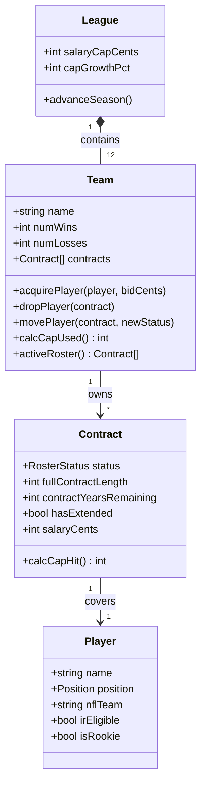

# CLAUDE.md

This file provides guidance to Claude Code (claude.ai/code) when working with code in this repository.

# La Liga Lebowski — Project Memory

## What this is
A configurable NFL fantasy-football simulator implementing a custom league ruleset
(salary cap, multi-year contracts, blind-bid free agency, keepers, holdouts,
franchise/transition tags, season rollover). The MVP is a **terminal application**
covering drafting, roster management, and player acquisition. It will eventually be
used by a real friend group.

This is primarily a **learning project**. The owner (Jacob) is using it to learn
back-end fundamentals: data modeling, persistence, API design, and architecture.
**Optimize for Jacob's understanding, not for shipping speed.**

## Current state (2026-07-08)
Scaffolded and under TDD; committing to `main`. `package.json` + Vitest/TS toolchain are in
place. **Spec 001 (cap calculation) — `calcCapUsed` is done:** the in-memory domain core
computes status-weighted, floor-rounded committed cap. Shipped:
- `src/domain/rules.ts` — `RosterStatus` string-literal union + `CAP_MULTIPLIER_PCT`
  (ACTIVE 100 / IR 50 / PRACTICE_SQUAD 25, as integer percents).
- `Contract.calcCapHit()` — `floor(salaryCents * pct / 100)`, integer math; `status`
  defaults to ACTIVE.
- `Team.calcCapUsed()` — sums each contract's `calcCapHit()`. 6 green tests (empty, ACTIVE,
  IR, PS, mixed roster, floor-per-contract).

**Next step:** spec 001's deferred **legality chunk** — decide where `isCapLegal` lives
(Team / League / standalone), introduce `League` with `salaryCapCents`, then TDD the
`committed cap ≤ league cap` invariant.

## Stack
- TypeScript / Node.js
- Tests: **Vitest** (confirmed on init), red-green-refactor.
- Persistence: start **in-memory**, then SQLite, then Postgres. Deliberate layers —
  do not jump ahead to a database before the in-memory core is solid.
- **No external APIs in the MVP.** The player pool is static seed data. Real NFL stat
  integration is a later, deliberate module — not an MVP dependency.

## Commands
Vitest + `tsc`, wired in `package.json`:
- `npm test` — run the suite once (`vitest run`)
- `npm run test:watch` (or `npx vitest`) — watch mode = the red-green-refactor inner loop
- `npx vitest run <file>` — a single test file
- `npx vitest run -t "<name>"` — a single test by name
- `npm run typecheck` — type-check only, no emit (`tsc`, `noEmit` in tsconfig)

## Architecture — the core principle
Strict separation, ports-and-adapters style:
- `src/domain/` — the pure domain core: entities + rules. **No I/O. No framework.
  No DB. No console.** Must be unit-testable in complete isolation.
- `src/cli/` — the terminal adapter (one way to drive the core).
- `src/persistence/` — the storage adapter.

The terminal is just one adapter over the core. The core must not know what is
driving it. New interfaces or storage layers are added as new adapters **without
modifying the core.**

## Domain model (current — designed by Jacob)

- **League** owns 12 **Teams** and holds league-wide rules (cap in cents, 5% annual
  cap growth, `advanceSeason()` = the ordered March-1 rollover cascade).
- **Team** owns many **Contracts**. A team's roster is **not stored** — it is a
  *query* over its contracts by status.
- **Contract** is the team↔player relationship: status, salary (cents), term, years
  remaining, `hasExtended`. It carries the status; the Player does not.
- **Player** is the global NFL human — exists with or without a contract (free agents
  have none). Holds real-world facts only. `irEligible` names the *concept* of IR
  eligibility (configurable per league), not a fixed mechanism.

### RosterStatus → cap multiplier (data-directed; NOT subclasses)
| Status         | Cap multiplier | Counts vs 26-man? | Capacity | Eligibility    |
| -------------- | -------------- | ----------------- | -------- | -------------- |
| ACTIVE         | 100%           | yes               | —        | —              |
| IR             | 50%            | no                | 5        | irEligible     |
| PRACTICE_SQUAD | 25%            | no                | 8        | isRookie       |
| (DROPPED)      | coming — deferred                                          |

## Hard conventions (invariants & idioms)
- **Money is always integer cents.** Never floats for money.
- **Derive, don't store.** Cap used, current roster, counts → computed from contracts
  on demand. Do **not** cache without a *measured* need and an invalidation strategy.
- **Fixed-value fields are unions** (Position, RosterStatus) — never magic strings.
- **Status is data, not type.** Anything that changes which "bucket" it's in is a
  status field, never a subclass.
- **Central invariant:** committed cap ≤ league cap, *always*, after every
  transaction. Rules are validated at the moment of mutation by querying current state.
- **Single source of truth.** Never add a second way to answer the same question
  (e.g. a cached roster array alongside the contracts).

## How to work with Jacob
Jacob stays the architect. You are a **spotter and tutor, not an autocomplete.**
- **Explain before implementing.** Rationale first, code second. He wants *why*.
- **Architecture-critical code** (domain API shape, module boundaries, data models,
  cap logic): propose options + tradeoffs, let Jacob decide. **Jacob writes these
  tests himself — do not write them for him.**
- **Rules-dictated logic** (cap math values, dead-money tables, scoring, holdout
  thresholds — behavior fully pinned by the ruleset): you may generate tests *from
  the ruleset*, and Jacob implements to green.
- **Small, reviewable chunks.** Don't advance until Jacob can explain the diff. If he
  can't, slow down and explain.
- **Don't over-engineer or build ahead.** His known trap is over-structuring — help
  him resist it. Park deferred items until their turn.
- When behavior is wrong, fix the spec first, then the code.

## Methodology
- **Outer loop:** a short spec per feature in `/specs` (REASONS-canvas style, by hand,
  no heavy tooling), written and owned by Jacob.
- **Inner loop:** TDD on the domain core. Red → green → refactor.

## Deferred — do not build yet
Dead-money on dropped players (DROPPED status, and drop-then-reacquire → one Player
with two Contracts), holdout resolution, franchise/transition tags, the full
season-rollover cascade ordering, persistence beyond in-memory, any UI/client, real
NFL data integration, lineup-setting with slot eligibility.

## The ruleset
The authoritative custom rules live in `docs/la-liga-rules.txt`. When implementing any
rule, **read it there** — do not infer from memory.
